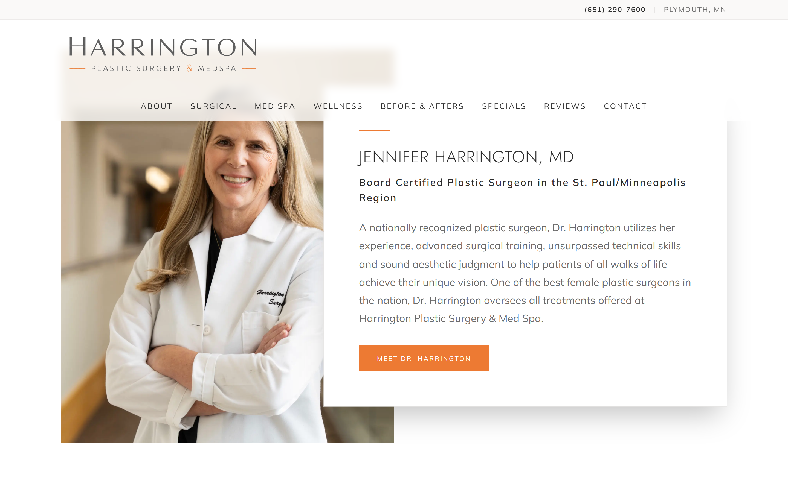
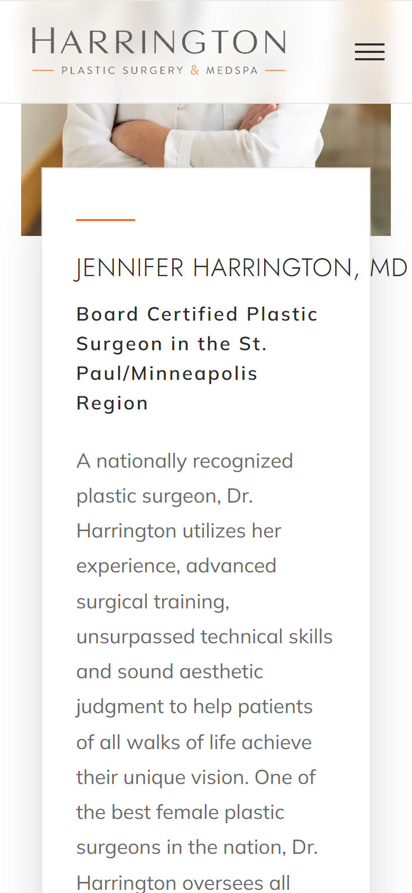
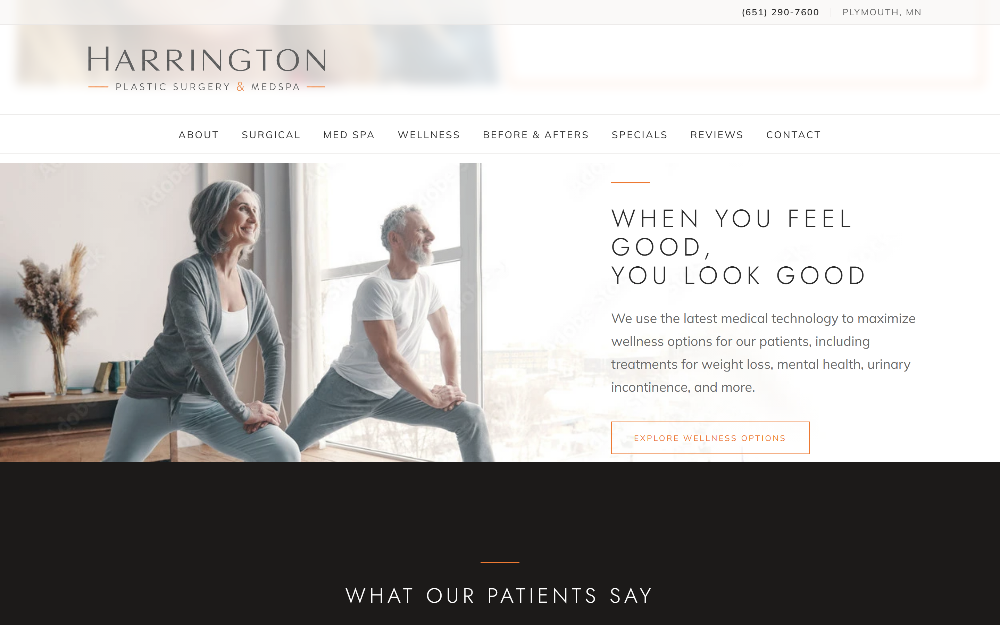
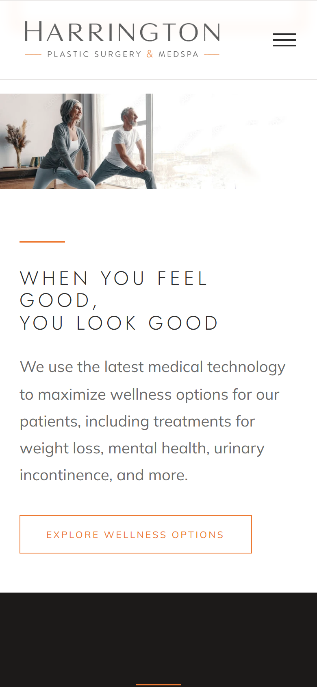
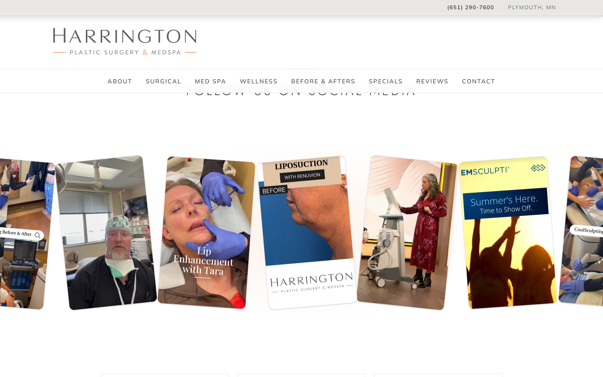
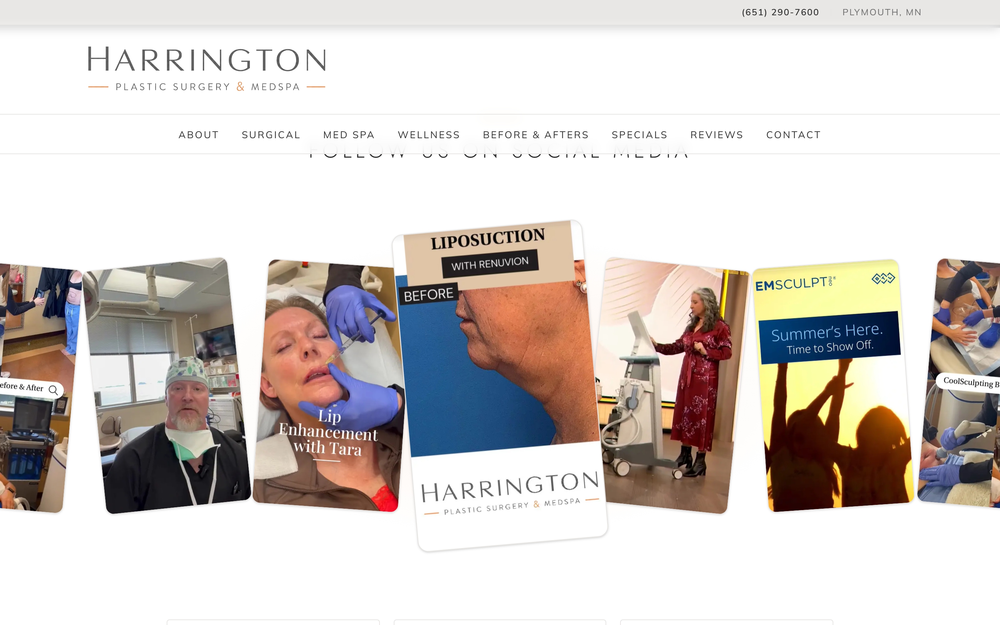
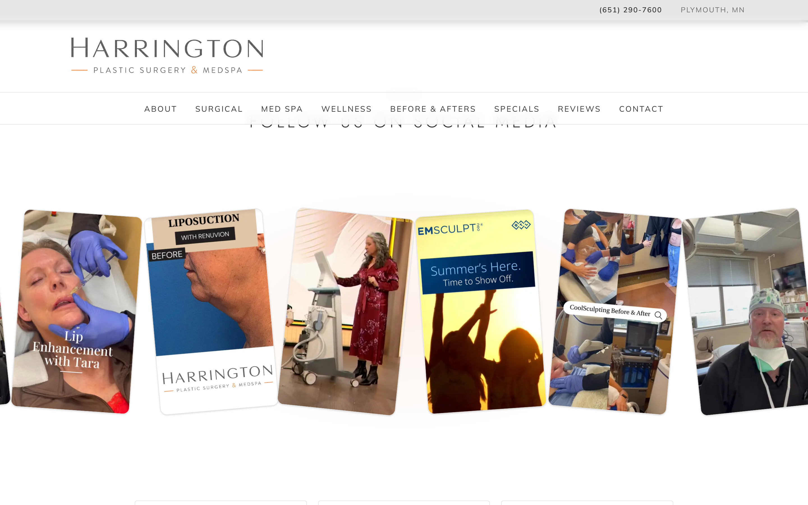
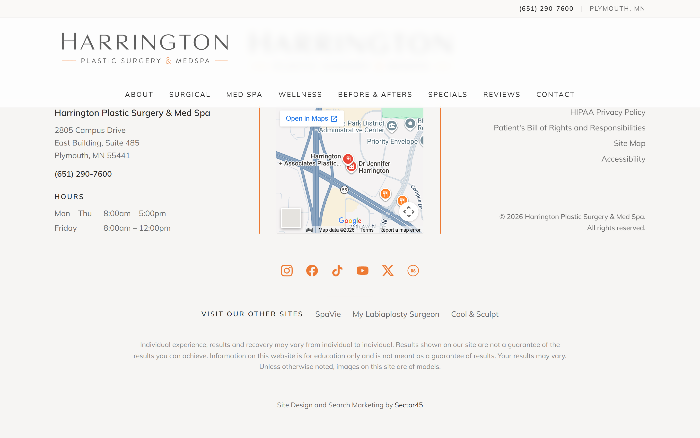
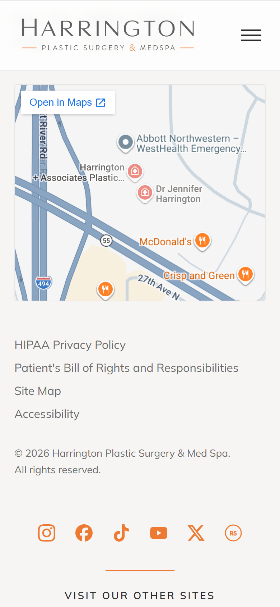

# Harrington Plastic Surgery & Med Spa — Homepage QA

Visual proof for Matt Moore's morning review, implemented in
`Secor45-Git/harrington` @ commit `5ee24b7`.

- **Live (production, Vercel `READY`):** https://harrington-s45.vercel.app

Full-**viewport** crops (not full-page) at desktop **1440×900** and mobile
**390×844** so proportions show.

## 1. Doctor — centered with equal margins
The whole photo + overlapping white card unit is now centered in the viewport
(measured **112px left / 112px right @1440**), instead of being left-shifted
with a large empty gap on the right.

| 1440 | 390 |
|---|---|
|  |  |

## 2. Wellness — provided banner as a full-width short band
Reverted to the provided Downloads `wellness.jpg` (**1250×373** senior-couple
banner). Used as a full screen-width (100vw) background spanning the section
edge to edge; the aspect box matches the source so the **full image shows with
no cropping** (couple on the left). The text overlays the bright/blank right
area on desktop and stacks below the band on mobile. (Source softness accepted.)

| 1440 | 390 |
|---|---|
|  |  |

## 3. Social — varied card angles restored (pop-and-hold kept)
Resting cards sit at alternating ~−6°…+6° tilts again. Each card keeps its tilt
while it pops to ~1.3× at center, holds ~3s, then pops back.

| Varied resting angles | Center card popped (1.3×) | Mid-transition |
|---|---|---|
|  |  |  |

## 4. Footer — verified against the mockup
Copyright / map / left-column bottoms align (measured **~458px**), orange 2px
rules flank the map at full height, hours sit close to the day labels, "All
rights reserved." is on its own line, and the name reads **"Harrington Plastic
Surgery & Med Spa"**.

| 1440 | 390 |
|---|---|
|  |  |
