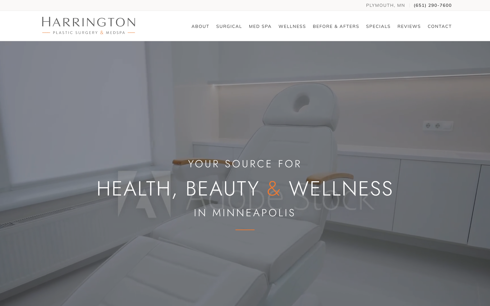
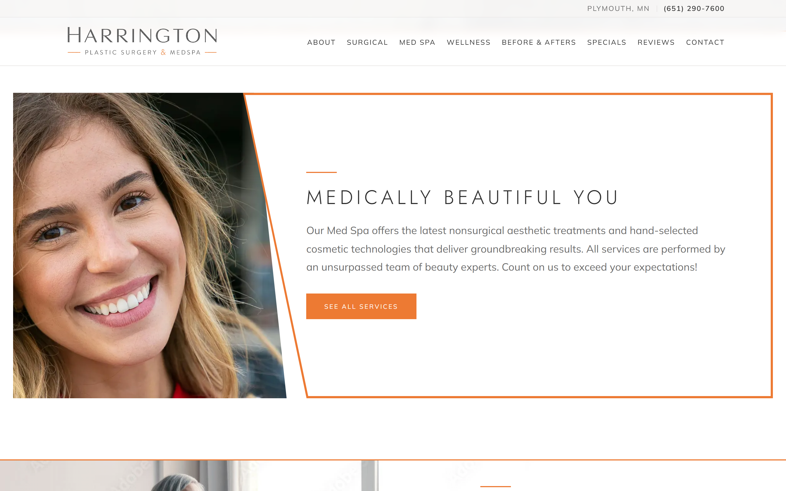
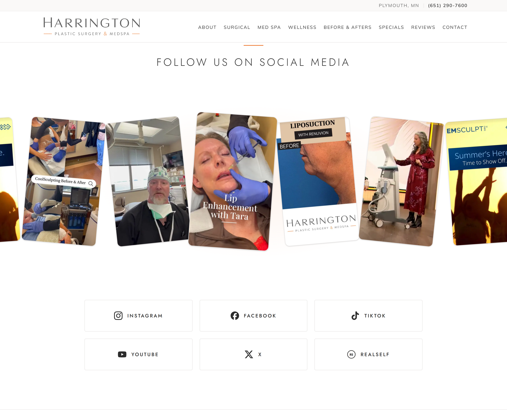
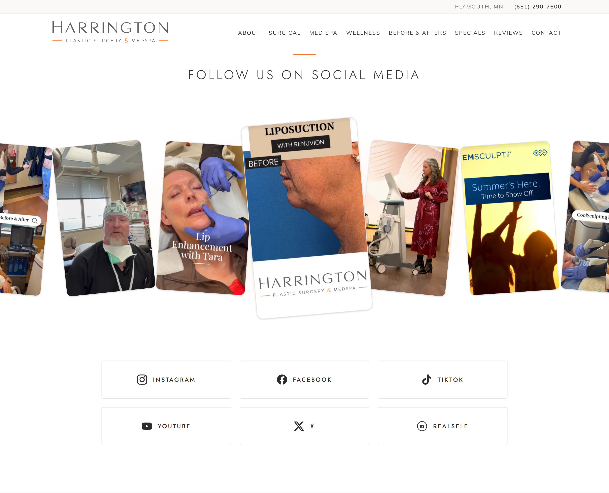
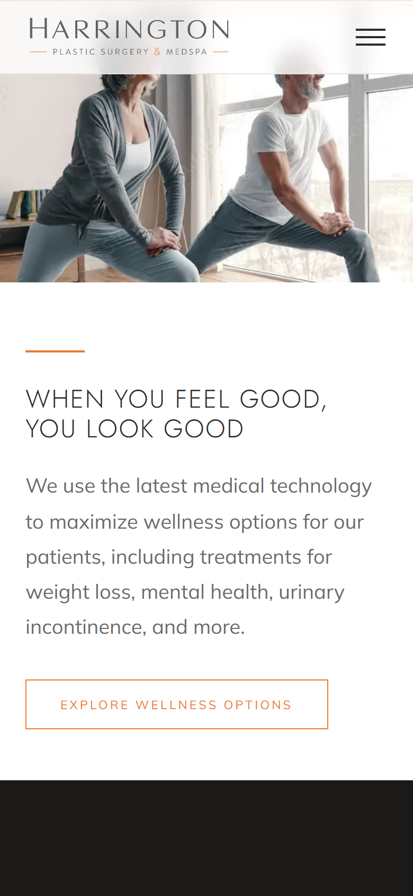

# Harrington Plastic Surgery & Med Spa — Homepage QA

Visual proof for Matt Moore's review round, implemented in
`Secor45-Git/harrington` @ commit `defa0db`.

- **Live (production, Vercel `READY`):** https://harrington-s45.vercel.app

Full-viewport crops: desktop **1440×900**, mobile **390×844**.

## A. Header — nav on the logo row, shorter
Utility line (location · phone, phone right-most) over a single logo+nav row.
Header height **222px → 121px @1440**; nav sits on the logo's row (1 row, no wrap).

## B. Doctor — spans the header content width
Photo left edge **112px == header logo left**; card right edge **1328px == header
phone right**. Card is **wider than tall (769×541)** with reduced overlap, a
floating box on the neutral wash.

## C. Med Spa — orange rules + 3-line copy
2px full-width orange rules above and below; new body copy sized to **3 lines**
on desktop.

## D. Social — continuous, nonstop, ~1s centre pop
The strip never stops; the card crossing centre swells to ~1.3× for ~1s, then
settles as the next reaches centre. Varied tilts kept. Three frames — featured
card at left, centre (popped 1.29×), and right:

| Featured left (mid-motion) | Centre — popped 1.29× | Featured right (mid-motion) |
|---|---|---|
|  |  |  |

## E. Footer — larger logo, map sized to columns & logo
Larger logo (442px wide). Map **height == side columns (290px)** and **width ==
logo (442px)**; orange rules **shorter (174 < 290)** and further from the map.

## F. Mobile wellness — portrait crop
Phones use `wellness-mobile.jpg` (554×370, stored in repo); desktop keeps the
wide banner.

