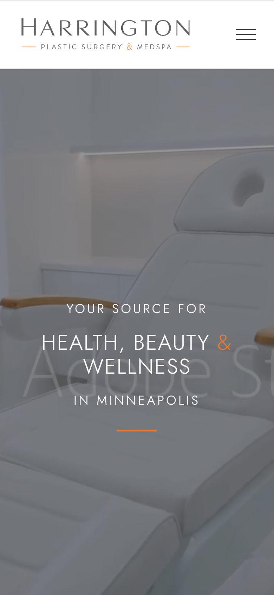
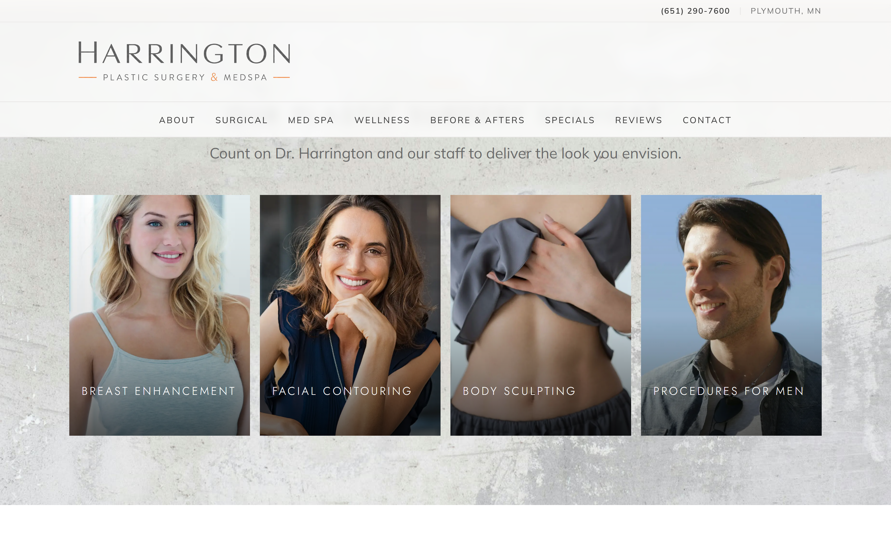
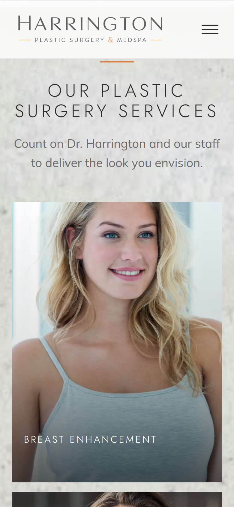
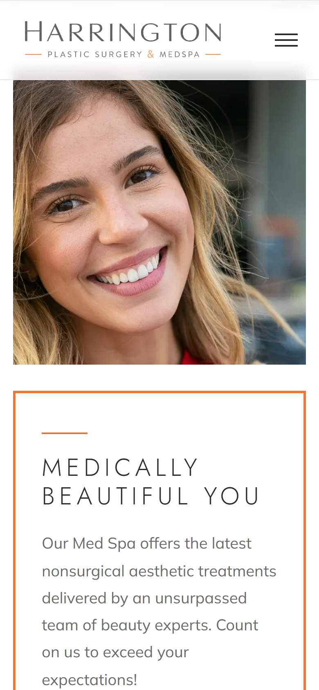
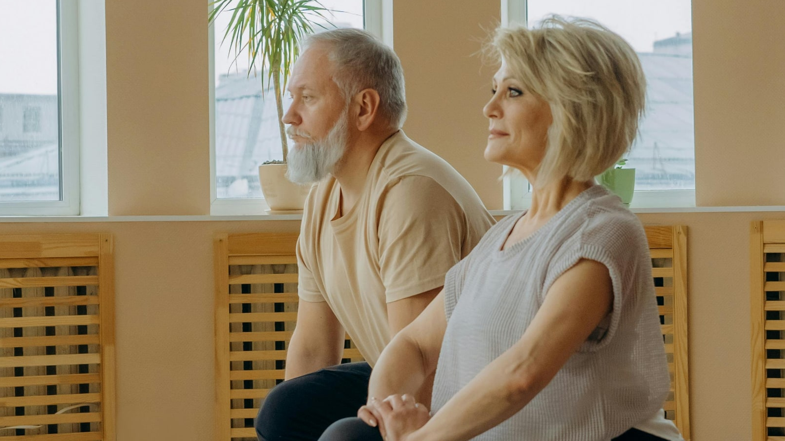
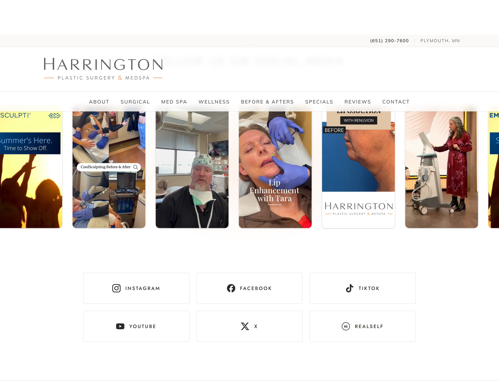
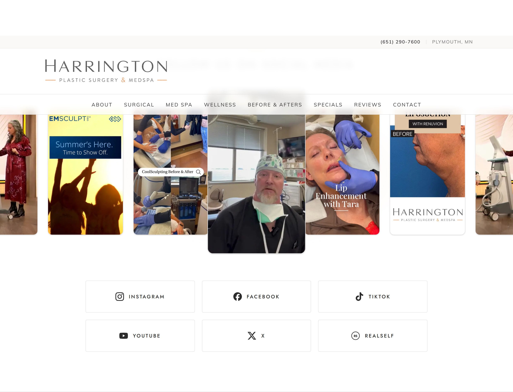

# Harrington Plastic Surgery & Med Spa — Homepage QA (Matt Moore review)

Visual proof for the art-director review implemented in
`Secor45-Git/harrington` @ commit `d32eecf`.

- **Live (production, Vercel `READY`):** https://harrington-s45.vercel.app
- **Computed body-paragraph font-size @1440:** **19px** (up from 14px under the
  reverted 12.5% downscale) — confirms body copy increased.

Screenshots are **full-viewport** crops (not full-page) so proportions show:
desktop **1440×900** and mobile **390×844**.

## Header (utility bar → larger logo → dedicated nav row; no wrap 1280–1440)
| 1440 | 390 |
|---|---|
|  |  |

## Doctor (centered with side margins; larger card; 19px body)
| 1440 | 390 |
|---|---|
|  |  |

## Plastic Surgery (considerably larger subtext)
| 1440 | 390 |
|---|---|
|  |  |

## Med Spa (orange-bordered box, angled left edge echoing the image cut, copy moved right)
| 1440 | 390 |
|---|---|
|  |  |

## Wellness (wellness.jpg as full-width background, text overlaid on the right)
| 1440 | 390 |
|---|---|
|  |  |

### Wellness background — high-resolution fix
The original `wellness.jpg` was only **1250×373** and looked soft when stretched
full-bleed. Replaced with a genuinely high-res, license-clean photo
([Pexels / Mikhail Nilov](https://www.pexels.com/photo/elderly-man-and-woman-doing-leg-stretching-exercise-on-yoga-mat-7500321/),
Pexels License — free commercial use, no attribution required), downloaded at
6000×4000 and cropped/stored at **3840×1813** in the repo.

Verified on the live deploy @ **1440 / DPR 2**:
- **(a) source intrinsic:** `public/images/wellness.jpg` = **3840×1813**
- **(b) variant downloaded:** `/_next/image?...&w=3840&q=90` → **3840×1813 WebP**
- **(c) ≥ 2880px @2x:** ✅ 3840 ≥ 2880 (crisp)

**Native-resolution (100%) crop of the new background** — true pixels, no
downscaling, showing genuine sharpness (hair, fabric, skin detail):

## Footer (~25% bigger; renamed; aligned bottoms; orange rules flank map)
| 1440 | 390 |
|---|---|
|  |  |

## Social carousel — pop-and-hold (three frames ~1s apart)
Measured: each card pops to exactly **1.3×** at dead-center and holds ~3s, then
drops to **1.0×** (none enlarged) between steps.

| Regular (none popped, 1.0×) | Popped-large (1.3×, centered, held) | Mid-transition (1.22×, off-center) |
|---|---|---|
|  |  |  |
